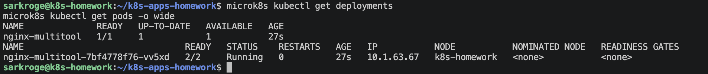
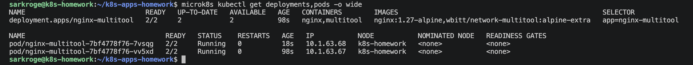
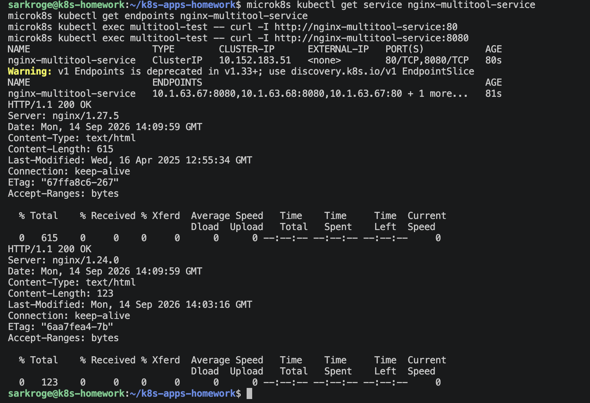
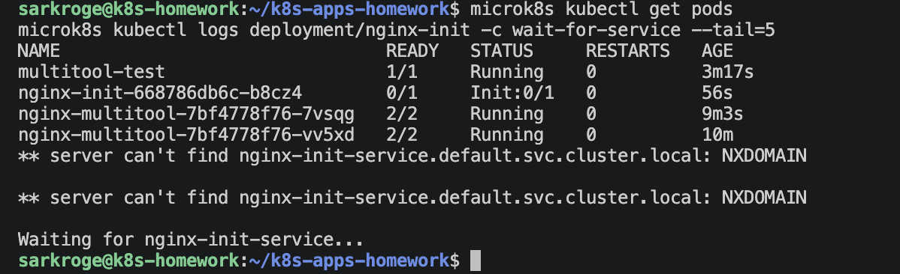
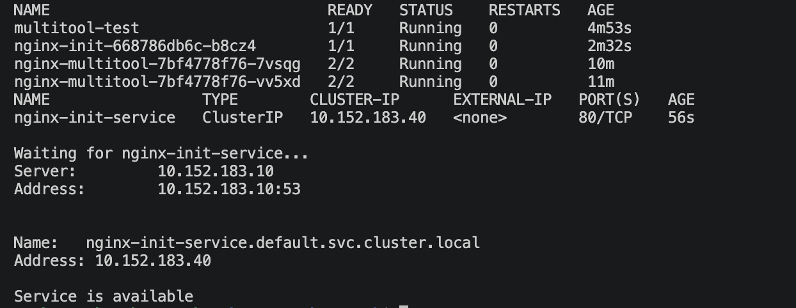

# Домашнее задание «Запуск приложений в Kubernetes»

## Используемое окружение

- Ubuntu 24.04 LTS
- MicroK8s
- Kubernetes 1.35
- одноузловой кластер в Yandex Cloud

Проверка состояния кластера:

```bash
microk8s status --wait-ready
microk8s kubectl get nodes
```

---

## Задание 1. Deployment с nginx и multitool

### Манифесты

- [Deployment nginx и multitool](task1/deployment.yaml)
- [Service](task1/service.yaml)
- [Проверочный Pod с multitool](task1/multitool-pod.yaml)

### 1. Создание Deployment

Deployment состоит из двух контейнеров:

- `nginx`;
- `network-multitool`.

Контейнеры внутри одного Pod используют общее сетевое пространство. По умолчанию оба приложения пытаются занять порт `80`, из-за чего возникает конфликт портов.

Для устранения конфликта HTTP-порт контейнера `multitool` изменён на `8080`:

```yaml
env:
  - name: HTTP_PORT
    value: "8080"
```

Deployment был создан командой:

```bash
microk8s kubectl apply -f task1/deployment.yaml
```

Проверка:

```bash
microk8s kubectl get deployments,pods -o wide
```

### 2. Состояние до масштабирования

Изначально Deployment был запущен с одной репликой. Внутри Pod успешно работают два контейнера, поэтому в столбце `READY` отображается `2/2`.



### 3. Масштабирование Deployment

Количество реплик было увеличено до двух:

```bash
microk8s kubectl scale deployment nginx-multitool --replicas=2
microk8s kubectl rollout status deployment/nginx-multitool
```

Проверка количества реплик:

```bash
microk8s kubectl get deployments,pods -o wide
```

После масштабирования запущены два Pod. В каждом Pod работают контейнеры `nginx` и `multitool`.



### 4. Создание Service

Для доступа к контейнерам создан Service типа `ClusterIP`:

```bash
microk8s kubectl apply -f task1/service.yaml
```

Service предоставляет два порта:

| Приложение | Порт Service | Порт контейнера |
|---|---:|---:|
| nginx | 80 | 80 |
| multitool | 8080 | 8080 |

Проверка Service:

```bash
microk8s kubectl get service nginx-multitool-service
```

### 5. Проверка доступа из отдельного Pod

Создан отдельный Pod с приложением `network-multitool`:

```bash
microk8s kubectl apply -f task1/multitool-pod.yaml
microk8s kubectl wait \
  --for=condition=Ready \
  pod/multitool-test \
  --timeout=120s
```

Доступ к nginx проверен командой:

```bash
microk8s kubectl exec multitool-test -- \
  curl -I http://nginx-multitool-service:80
```

Доступ к multitool проверен командой:

```bash
microk8s kubectl exec multitool-test -- \
  curl -I http://nginx-multitool-service:8080
```

Оба приложения вернули ответ:

```text
HTTP/1.1 200 OK
```



---

## Задание 2. Запуск основного контейнера после появления Service

### Манифесты

- [Deployment с init-контейнером](task2/deployment.yaml)
- [Service](task2/service.yaml)

### 1. Создание Deployment

В Deployment настроен init-контейнер на основе образа `busybox`.

Init-контейнер проверяет наличие DNS-имени Service:

```sh
until nslookup nginx-init-service.default.svc.cluster.local; do
  echo "Waiting for nginx-init-service..."
  sleep 2
done

echo "Service is available"
```

Основной контейнер `nginx` запускается только после успешного завершения init-контейнера.

Deployment был создан до создания Service:

```bash
microk8s kubectl apply -f task2/deployment.yaml
```

### 2. Состояние до создания Service

Проверка состояния Pod:

```bash
microk8s kubectl get pods
```

Проверка журнала init-контейнера:

```bash
microk8s kubectl logs \
  deployment/nginx-init \
  -c wait-for-service
```

Пока Service отсутствовал, Pod находился в состоянии `Init:0/1`, а init-контейнер выводил сообщение:

```text
Waiting for nginx-init-service...
```

Основной контейнер nginx при этом не запускался.



### 3. Создание Service

Service создан командой:

```bash
microk8s kubectl apply -f task2/service.yaml
```

После появления DNS-имени `nginx-init-service.default.svc.cluster.local` init-контейнер успешно завершил работу.

Проверка запуска Deployment:

```bash
microk8s kubectl rollout status deployment/nginx-init
```

Проверка состояния ресурсов:

```bash
microk8s kubectl get pods
microk8s kubectl get service nginx-init-service
```

После создания Service Pod перешёл в состояние `Running`, а в журнале init-контейнера появилось сообщение:

```text
Service is available
```



---

## Результат

В ходе выполнения работы:

1. Создан Deployment с контейнерами `nginx` и `multitool`.
2. Устранён конфликт сетевых портов внутри Pod.
3. Deployment масштабирован с одной до двух реплик.
4. Создан Service для доступа к обоим приложениям.
5. Доступ к приложениям проверен из отдельного Pod.
6. Создан Deployment с init-контейнером `busybox`.
7. Обеспечен запуск nginx только после появления требуемого Service.
